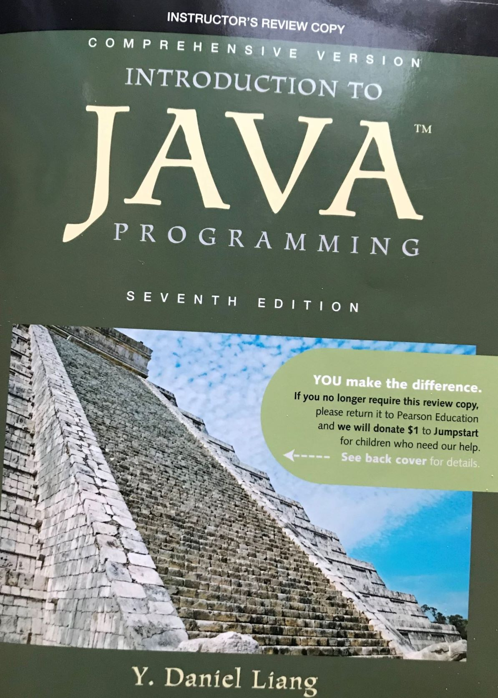

# Intro-to-Java

## Code playing ground for Liang's Introduction to Java Programming (7th Edition)

My solutions to the exercises in the book are arranged on chapter-by-chapter basis. The codes are well-commented for complete understanding of readers.
And the problems are also re-produced.

Note: The .class files are the compiled versions of the .java files.
The solutions were firstly complied using `javac MyFile.java` before they are run using `java MyFile` at the terminal.

Should in case there is a better solution to any of the exercises, kindly send a pull request!